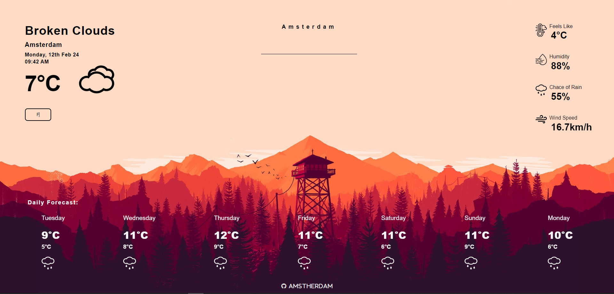
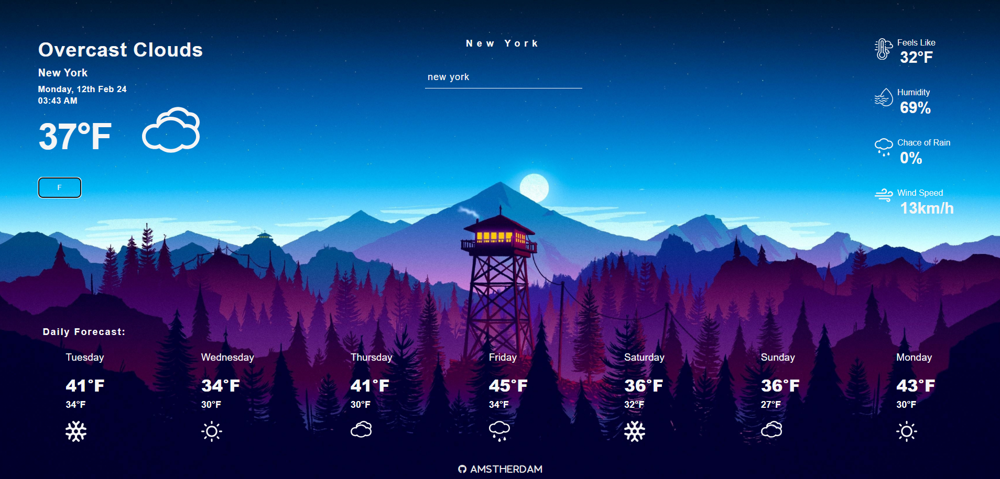

# Weather App

Weather application used to show forecast from OpenWeather API.
[WeatherApp](https://weatherappamstherdam.netlify.app/)

Learning project from [The Odin Project](https://www.theodinproject.com) curriculum.

## Features

- Get current and weekly weather forecast.
- Search cities worldwide.
- Switch between celsius and fahrenheit temperatures.
- Responsive design.
- Wall picture according to the sun condition of the searched location.

## Built With

#### Technologies

- JavaScript
- SCSS
- HTML

#### Tools

- Visual Studio Code
- Git and GitHub
- Webpack
- Prettier

#### Third Party Code

- [data-fns](https://date-fns.org/)
- [Google Fonts](https://fonts.google.com/)
- [Font Awesome](https://fontawesome.com/)

## Outcome

- Used public API to get data.
- Used Webpack to build the app.
- Used third-party library for date and time formating.
- Used SCSS for the desing.
- Learned error handling a bit.
- With this project, I learned how to get data from the API.
- I learned and practiced await and async functions.
- Tried to maintain clean code.
- I learned to write more descriptive comment lines for functions.
